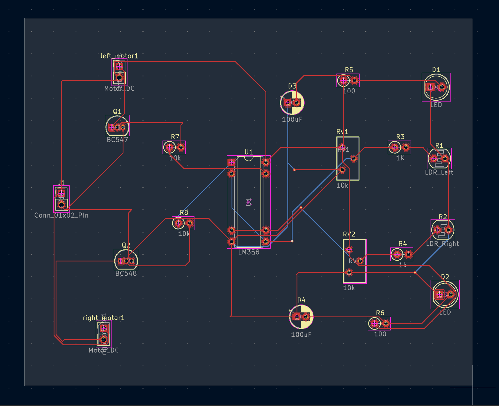
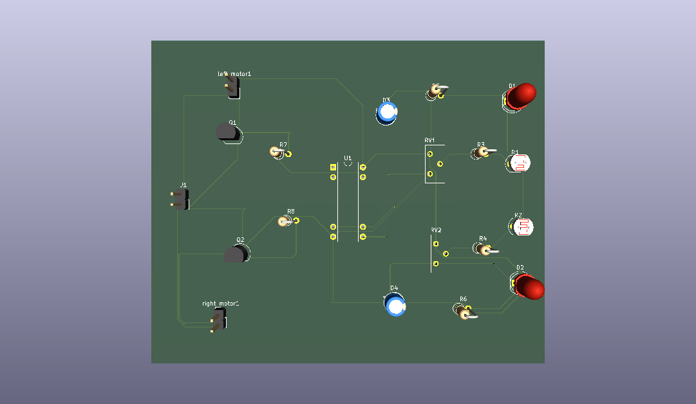

# analog-line-following-robot — Custom PCB Design

A line-following robot built entirely from discrete analog components — no microcontroller, no programmable logic. This repo covers the full circuit design and my custom KiCad schematic/PCB layout, built on top of a line-following robot.

## Overview

The robot follows a black line on a white surface using visible-light sensing, analog comparison, and transistor-driven motors — all without any digital logic or code. The signal path has three stages:

Sensing — a pair of LDR (photoresistor) voltage dividers, each paired with a white LED that actively floods the surface below the robot with light
Comparison — a single LM358 op-amp, configured in open-loop mode, compares the left and right sensor channels directly against each other: each side's LDR and potentiometer sit in series forming one voltage-divider row, and the op-amp's two inputs are the left row's voltage and the right row's voltage. Whichever side is reading brighter (or darker) relative to the other drives the output high or low, with the potentiometers used to balance and calibrate the two sensor rows against each other
Actuation — the comparator output drives BJTs (acting as switches) that control current to two DC gear motors, steering the robot by adjusting each wheel's power independently

## How it works

Each LDR sits in a voltage divider with its own potentiometer, one row for the left sensor and one for the right. When a surface reflects more light back into an LDR, that LDR's resistance drops and its row's voltage falls; over the black line, less light returns, resistance rises, and the row's voltage climbs. The two rows are compared directly against each other rather than against a fixed threshold.

The LM358 takes the left LDR+potentiometer row's voltage and the right LDR+potentiometer row's voltage as its two inputs, snapping the output high or low depending on which side reads higher, rather than passing through a slow analog gradient. That clean digital-like output feeds the base of an NPN BJT, which switches motor current on or off. Flyback diodes across each motor protect the transistors from voltage spikes when the motor switches off, and electrolytic capacitors across the power rails smooth out ripple from the motors starting and stopping.

Because the single comparator output feeds both motor-driving BJTs, the two motors respond oppositely to the same left-vs-right comparison: when the robot drifts and one sensor row reads higher relative to the other, one motor speeds up (or the other slows/stops) to steer the robot back onto the line.


## Repo contents

```
├── kicad/              KiCad project, schematic, and PCB layout files
├── images/
│   ├── schematic.png
│   ├── pcb-layout.png
│   └── 3d-render.png
└── media/
    └── demo-video link
```

## Schematic


## PCB layout (routed)



## 3D render



## Demo

Add a video/photos of your own build navigating the track here.

## Key components

| Part | Role |
|---|---|
| LM358 dual op-amp | Voltage comparator, open-loop configuration |
| CdS photoresistor (LDR) x2 | Reflected-light sensing |
| White LED x2 | Active illumination of the surface |
| PN2222 NPN BJT x2 | Motor switching stage |
| N20 gear motor x2 | Differential drive |
| 10k potentiometer x2 | Comparator reference voltage / calibration |
| 1N4001 diode x2 | Motor flyback protection |
| 100µF electrolytic capacitor x2 | Power rail smoothing |

## Tools used

- KiCad (schematic capture, PCB layout, ERC/DRC)
- LTspice (circuit simulation, sensor and comparator characterization)
- Oscilloscope (hardware verification of LED/motor drive signals)

## Notes

This is a portfolio piece, not a manufacturing-ready design — the PCB has not been fabricated. The goal was to take a working discrete-analog circuit and produce a clean, fully-connected schematic-to-layout design as practice in PCB design workflow.
