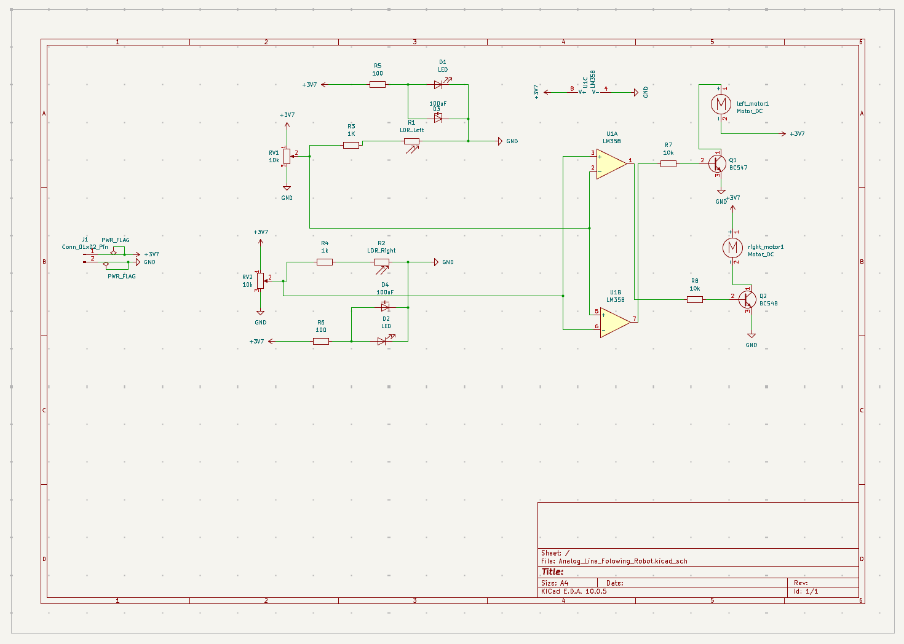

# analog-line-following-robot — Custom PCB Design

A line-following robot built entirely from discrete analog components — no microcontroller, no programmable logic. This repo covers the full circuit design and my custom KiCad schematic/PCB layout, built on top of a line-following robot.

## Overview

The robot follows a black line on a white surface using visible-light sensing, analog comparison, and transistor-driven motors — all without any digital logic or code. The signal path has three stages:

- **Sensing** — a pair of LDR (photoresistor) voltage dividers, each paired with a white LED that actively floods the surface below the robot with light
- **Comparison** — the LM358 package's two op-amps are each wired as a comparator using the same left-row and right-row voltages, but with the `+`/`−` inputs swapped between them: one op-amp takes the left row on `+` and the right row on `−`, the other takes the right row on `+` and the left row on `−`. This produces two separate, naturally complementary outputs — one op-amp per motor — instead of a single shared output
- **Actuation** — the comparator output drives BJTs (acting as switches) that control current to two DC gear motors, steering the robot by adjusting each wheel's power independently

## How it works

Each LDR sits in a voltage divider with its own potentiometer, one row for the left sensor and one for the right. When a surface reflects more light back into an LDR, that LDR's resistance drops and its row's voltage falls; over the black line, less light returns, resistance rises, and the row's voltage climbs. The two rows are compared directly against each other rather than against a fixed threshold.

Each op-amp takes the left row's voltage and the right row's voltage as its two inputs, but with the `+` and `−` connections reversed relative to the other op-amp. Because of that reversal, when one side reads higher than the other, the two op-amp outputs snap in opposite directions — one goes high while the other goes low — rather than passing through a slow analog gradient. Each output feeds the base of its own NPN BJT, switching that motor's current on or off. Flyback diodes across each motor protect the transistors from voltage spikes when the motor switches off, and electrolytic capacitors across the power rails smooth out ripple from the motors starting and stopping.

Because the two op-amp outputs are naturally complementary (one high while the other is low, and vice versa), the two motors respond oppositely to the same left-vs-right comparison: when the robot drifts and one sensor row reads higher relative to the other, one motor speeds up while the other slows or stops, steering the robot back onto the line.

## Repo contents

```
├── kicad/              KiCad project, schematic, and PCB layout files
├── images/
│   ├── schematic.png
│   ├── pcb-layout.png
│   └── 3d-render.png
└── media/
    └── demo-video link
```

## Schematic



## PCB layout (routed)


## 3D render


## Demo


https://github.com/user-attachments/assets/1498a725-2bcb-41b3-9672-68c0f6f58ff7


## Key components

| Part | Role |
|---|---|
| LM358 dual op-amp | Voltage comparator, two channels wired with reversed inputs |
| CdS photoresistor (LDR) x2 | Reflected-light sensing |
| White LED x2 | Active illumination of the surface |
| PN2222 NPN BJT x2 | Motor switching stage |
| N20 gear motor x2 | Differential drive |
| 10k potentiometer x2 | Sensor calibration / balancing |
| 1N4001 diode x2 | Motor flyback protection |
| 100µF electrolytic capacitor x2 | Power rail smoothing |

## Tools used

- KiCad (schematic capture, PCB layout, ERC/DRC)
- LTspice (circuit simulation, sensor and comparator characterization)
- Oscilloscope (hardware verification of LED/motor drive signals)
- Soldering iron (hand-soldered sensor and wiring connections)
